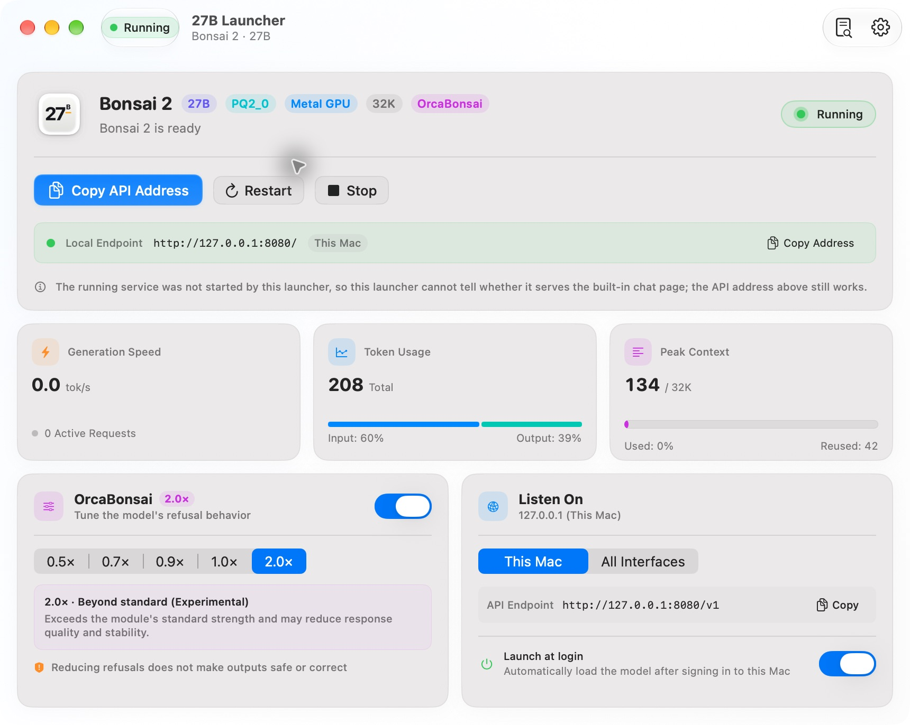
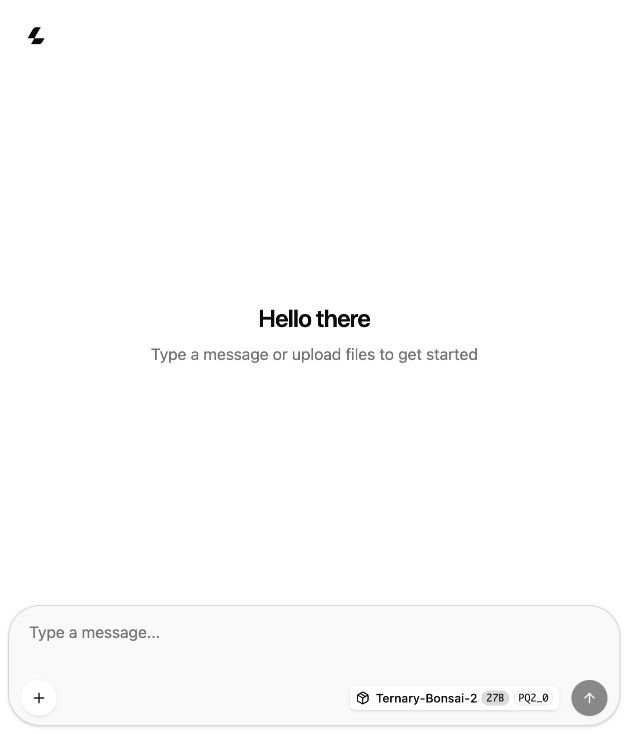

<p align="center">
  
</p>

# 27B Launcher

**Run Bonsai 2 27B locally on your Mac, from a native desktop app.**

27B Launcher downloads the model and runtime, manages the local inference server,
and gives you a desktop control panel for chat, API access, model storage, and the
OrcaBonsai module. Inference runs on your Mac; no cloud account is required.

**English** · [简体中文](README.zh-CN.md)

[Get started](#get-started)

> Official Release packages are Developer ID signed and notarized by Apple.
> There is no in-app automatic updater; use Homebrew or install a newer Release.
> Source builds use an ad-hoc signature.

## See it in action

<p align="center">
  
</p>

### Chat in your browser

Ask Bonsai 2 to draft an email, then refine the answer with a follow-up.

<p align="center">
  
</p>

## Why 27B Launcher?

- **Guided setup:** downloads pinned runtime, model, vision projector, and adapter
  files with progress, pause/resume, bounded retries, and SHA-256 verification.
- **Daily controls:** start, stop, restart, open local chat, and inspect logs from
  a normal Dock app.
- **Live usage:** generation speed, input/output tokens, active requests, and
  context usage from the server's metrics endpoint.
- **Recoverable storage moves:** inspect the model location and move it with
  copy-and-verify migration and cancellation before the final switch.
- **OrcaBonsai controls:** enable or disable the adapter and select its strength.
  New settings default to enabled at 2.0×; saved choices are preserved.
- **Native preferences:** English, 简体中文, 繁體中文, and Español; system, light,
  and dark appearance; accessibility mode; optional launch at login.

This is a focused launcher for one model family, not a general model catalog.
It is an independent project, unaffiliated with Prism ML or Continuum AI.

## Requirements

| Requirement | Details |
| --- | --- |
| Mac | Apple silicon (`arm64`); Intel is unsupported |
| Operating system | macOS 14 or later to run the app |
| Unified memory | 16 GiB minimum; 32 GiB or more recommended; 16–31 GiB shows a warning |
| Download | About 7.86 GB for all four components on a fresh installation |
| Free disk space | Allow room for downloads, extracted runtime, and at least 1 GiB of safety space; storage migration also needs a second copy |
| Build tools | Xcode 26 or later with Swift 6.2 or later, on a macOS version supported by that Xcode |

The build-tool requirement is higher than the app's deployment target. The
installer checks architecture, memory, and storage before downloading. Large
contexts can still exhaust memory on supported Macs.

## Get started

### 1. Install

With [Homebrew](https://brew.sh):

```sh
brew tap mreasonyang/27b-launcher https://github.com/mreasonyang/27b-launcher
brew install --cask mreasonyang/27b-launcher/27b-launcher
open "/Applications/27B Launcher.app"
```

Alternatively, download the DMG from [Releases](https://github.com/mreasonyang/27b-launcher/releases/latest)
and drag **27B Launcher.app** into **Applications**. Both methods install only the
launcher; model setup happens on first launch. Existing source installations in
`~/Applications` are separate. See [Homebrew installation and maintenance](docs/HOMEBREW.md)
for upgrade, uninstall and data retention details.

#### Build from source

Clone this repository using its GitHub **Code** menu, or download and extract its
source archive. In Terminal, enter the resulting `27b-launcher` directory, then:

```sh
swift --version                  # 6.2 or later
swift test
./scripts/install.sh
open "$HOME/Applications/27B Launcher.app"
```

`install.sh` builds the app, verifies its signature, and installs it in
`~/Applications`. It replaces an existing installation with rollback on failure.
It does **not** download the model. No paid Apple Developer account is needed
for a local build. A downloaded ad-hoc ZIP/DMG may be blocked by Gatekeeper.

To build without installing, run `./scripts/build-app.sh`; the app is written to
`dist/27B Launcher.app`.

### 2. Follow the first-run guide

The guide appears until you finish or defer setup, even if model files are
already installed. Use **Help → Quick start** to revisit it later.

- **No model installed:** review the hardware, missing components, download size,
  required space, and destination. **Download and prepare** downloads, verifies,
  and loads the model. You can pause/resume or choose **Set up later** and return
  with **Continue setup**. Reopening the app preserves that deferred choice.
- **Model already installed:** usable components are reused. If the service is
  stopped, click **Start Model**; the guide does not download the model again.
- **Preparation complete:** the guide stays on its ready page. Click **Start
  chatting** to open your default browser, or enter the dashboard. Either action
  completes the guide; a successful browser-open request does not verify a reply.

The default data directory is `~/Library/Application Support/Bonsai2/`. It is
created during installation. Model location changes are available in Settings
**after installation**. You do not need a separate OrcaBonsai source checkout.
Revisions, sizes, and checksums are listed in
[third-party components](docs/THIRD_PARTY.md).

### 3. Chat or connect another app

The default chat URL is `http://127.0.0.1:8080/`. In the ready guide, the API base
URL `http://127.0.0.1:8080/v1` and the actual model ID from `/v1/models` are shown
with separate copy buttons. Choose an OpenAI-compatible provider in your client
and copy both fields exactly. Local mode needs no API key; clients requiring a
nonempty field can use `local`. If reading the model ID fails, retry in the guide.

The daily dashboard keeps its usage, OrcaBonsai, and network controls visible.
**Start Model** starts the service; open chat separately when it is ready.

### If preparation fails

Paused downloads retain progress; retries have a limit. Reopen the guide to
continue. If the model exits during loading, the guide stops waiting and offers
a retry and logs. In Settings, verify the model files and repair components
reported as damaged; intact components are retained. A missing custom storage
volume must be reconnected before continuing.

## Network access and privacy

| Listening scope | Access | Built-in chat |
| --- | --- | --- |
| Local only (default) | `127.0.0.1:8080`, no API key required | Available |
| All network interfaces | `0.0.0.0:8080`, API requests require the generated bearer key on a newly started managed server | Disabled; use an API client |

LAN clients must use this Mac's reachable IP address, not `0.0.0.0`. The service
uses plain HTTP, so a key alone does not encrypt traffic. Use a trusted network
or an authenticated encrypted tunnel. Copy or rotate the key in Settings.
If the managed server is running, rotation stops it before changing the key,
then starts it again. A stopped server stays stopped.

The launcher contains no analytics or crash-report upload client. Downloads contact
GitHub and Hugging Face. API keys are stored only in Keychain and passed to the
runtime through an anonymous pipe. Monitoring never sends an API key; token
statistics are available for known loopback launches only.

Data also includes macOS preferences, logs, any model directory you select, and
chat storage managed by your browser. See the [privacy and storage inventory](docs/PRIVACY.md)
for paths, network boundaries, and uninstall behavior.

## What to expect

- **Close, Quit, and Stop are different:** closing the window keeps downloads
  and monitoring running; reopen the app from the Dock to show the window again.
  Quitting ends downloads and monitoring but leaves the model server running.
  Reopen the launcher to resume unfinished downloads; use **Stop** to stop the model.
- **Recovery has limits:** five consecutive failed starts, or three crashes in
  ten minutes, pause automatic restarts. A manual Start resets the budget;
  reopening the launcher also clears it. Investigate recurring crashes in the logs.
- **Usage is per process:** token counters reset when the model server restarts.
  Input counts include newly processed and cache-reused tokens. Unavailable
  metrics show an unknown state, rather than a measured zero.
- **Fixed defaults:** port `8080`, context `32768`, reasoning budget `2048`.
  These are implementation defaults, not currently editable settings.
- **Model behavior is experimental:** OrcaBonsai changes refusal behavior.
  Loading successfully does not establish answer quality or safety;
  see the [upstream compatibility note](docs/THIRD_PARTY.md#compatibility).
- **Updates:** run `brew update` and `brew upgrade --cask mreasonyang/27b-launcher/27b-launcher`,
  install a newer DMG, or rebuild a source installation. Stop the model and quit
  the launcher before upgrading.

## Verification and documentation

The [0.10.11 acceptance record (中文)](docs/ACCEPTANCE.zh-CN.md) summarizes real
UI checks, fresh and existing model setup, and the 263-test regression run on
2026-09-30. It also lists scenarios still awaiting manual acceptance. Local
packages are ad-hoc signed; official Release packages are signed and notarized
by GitHub Actions. Neither establishes compatibility with every supported Mac.
See [CI scope](docs/CI-VALIDATION.md) and [release maintenance](docs/HOMEBREW.md).

The [onboarding behavior specification (中文)](design/onboarding/PROPOSAL.zh-CN.md)
describes the implemented flow.

## License and acknowledgments

The launcher's source code is covered by the repository's [MIT license](LICENSE).
Downloaded runtimes, model weights, and adapters retain their upstream licenses;
they are not included under the launcher's MIT grant.

Built with SwiftUI and AppKit, using the Prism fork of llama.cpp, Bonsai 2 by
Prism ML, and OrcaBonsai by Continuum AI. See [upstream sources and notices](docs/THIRD_PARTY.md).
