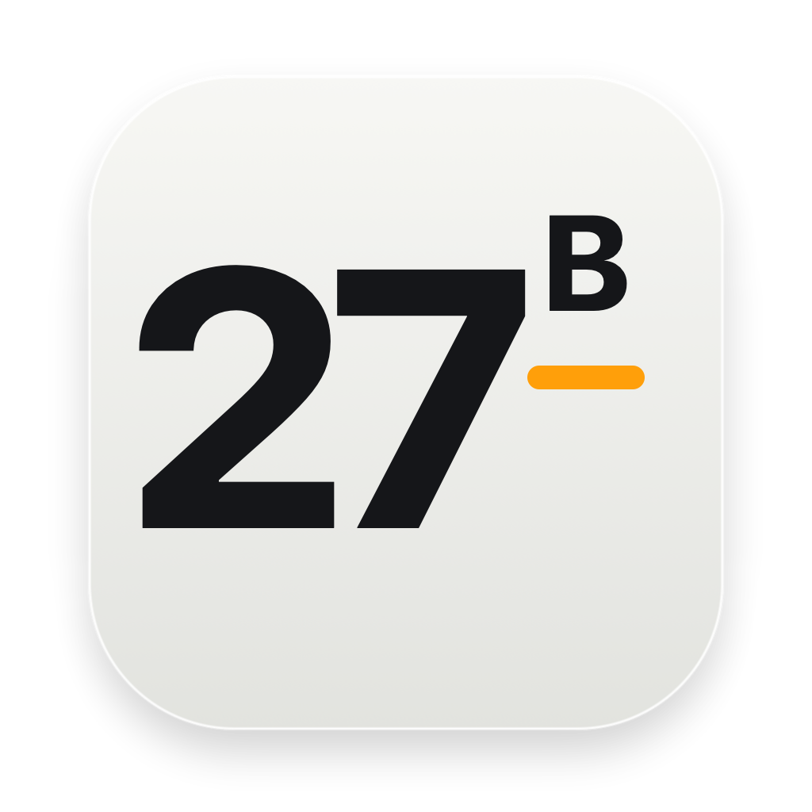
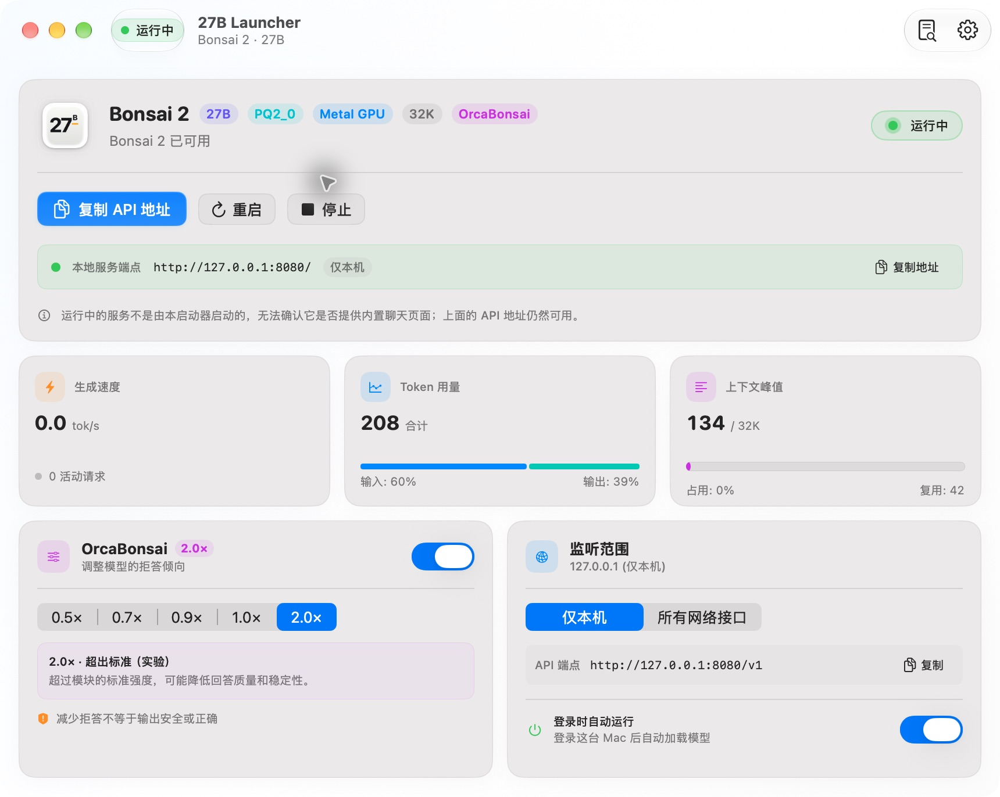
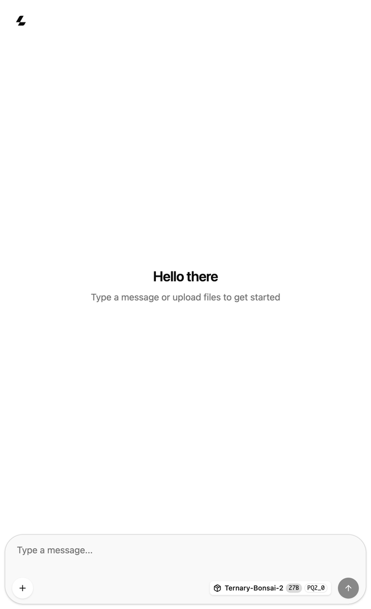

<p align="center">
  
</p>

# 27B Launcher

**通过原生 macOS 桌面应用，在自己的 Mac 上运行 Bonsai 2 27B。**

27B Launcher 负责下载模型与运行时、管理本地推理服务，并提供聊天入口、API、模型存储与 OrcaBonsai 模块控制。推理在本机完成，无需云端账户。

[English](README.md) · **简体中文**

[开始使用](#开始使用)

> 正式 Release 安装包采用 Developer ID 签名并通过 Apple 公证。本机源码构建使用 ad-hoc 签名。应用没有内置自动更新，可通过 Homebrew 或新版 DMG 升级。

## 界面与操作演示

<p align="center">
  
</p>

### 在浏览器中对话

让 Bonsai 2 起草一封邮件，再通过追问调整语气和长度。

<p align="center">
  
</p>

## 功能

- **引导安装**：下载固定版本的运行时、模型、视觉投影和适配器，支持进度显示、暂停续传、有限次数自动重试与 SHA-256 校验。
- **日常控制**：通过标准 Dock 应用启动、停止、重启模型，打开本地聊天页和日志。
- **实时用量**：从服务的 metrics 接口读取生成速度、输入/输出 Token、活动请求与上下文使用情况。
- **模型迁移**：查看实际路径和占用，先复制并校验，再切换位置；切换前可取消。
- **OrcaBonsai 模块**：启用或关闭适配器，并调整强度；没有保存设置时默认启用、强度为 2.0×，已有选择保持不变。
- **原生设置**：简体中文、繁體中文、English、Español；跟随系统、浅色或深色外观；无障碍模式与可选登录启动。

这是面向单一模型系列的独立启动器，不是通用模型库，也不隶属于 Prism ML 或 Continuum AI。

## 两个模型文件和 LoRA 分别是什么？

两个模型文件配合使用：**Bonsai 2 负责生成回答，视觉组件让它能理解图片**。
OrcaBonsai 则调整主模型的拒答行为。启动器会自动下载并连接这些组件，无需另外克隆模型仓库或手动配置。

| 组件 | 是什么 | 能用来做什么 |
| --- | --- | --- |
| **Bonsai 2 27B 主模型** — `Ternary-Bonsai-2-27B-PQ2_0.gguf`，约 7.21 GB | Prism ML 的 270 亿参数语言模型，采用紧凑的三值权重格式；本启动器选择 PQ2_0 打包版本。 | 本地聊天、起草与改写、总结你提供的文本、解释问题和辅助编程。实际生成文字回答的是它。 |
| **视觉模型/投影组件** — `Ternary-Bonsai-2-27B-mmproj-Q8_0.gguf`，约 0.63 GB | Bonsai 2 配套的图片处理组件，把图片转换成主模型能使用的表示；不能单独作为另一个聊天模型使用。 | 在本地聊天中附加图片，询问图片内容，例如描述照片或解读截图。它用于理解图片，不用于生成图片。 |
| **OrcaBonsai LoRA** — `bonsai-abliterate-lora.gguf`，约 9.68 MB | Continuum AI 提供的小型低秩适配器，与主模型权重一起加载，针对模型的“拒答方向”进行调整，不替换整套模型。 | 对比原模型与降低拒答后的表现，包括原本被误拒绝的正常请求。它不增加视觉能力，也不保证回答更准确。 |

在工作台关闭 **OrcaBonsai**，即可使用原模型配置；开启后可以选择 **0.5×～2.0×** 强度。
新设置默认**开启、2.0×**，运行中修改会重启模型。这个倍数表示适配器的作用强度，
不代表生成速度或“智力提升倍数”；可以用自己的任务对比效果，不必认为越强越好。

上游只报告了适配器配合 **PTQ1_0** 的实测，并明确注明**没有测试 PQ2_0**。
本项目使用 PQ2_0；本地聊天通过只证明该次运行成功，不能推导为上游评测效果相同。
安装版已实测上传图片并正确识别彩色形状及印刷文字；这不代表任意照片或截图都能准确理解。
这些组件不自带联网搜索，回答也可能出错；降低拒答不等于输出安全或正确。

来源：[Bonsai 2 模型说明](https://huggingface.co/prism-ml/Ternary-Bonsai-2-27B-gguf/blob/6ed5e12bf84b7a63069882c91dd9e9218647d17b/README.md)、
[OrcaBonsai 适配器说明](https://github.com/Continuum-AI-Corp/OrcaBonsai-27B-Uncensored/blob/947a80cd1d3b4f9a97417025e6c2c62223571287/README.md)。
第四个下载项是 **Prism llama.cpp 运行时**，负责在 Mac 上加载这些文件并提供聊天/API 服务。
固定版本、校验值与许可证见[第三方组件](docs/THIRD_PARTY.md)。

## 系统要求

| 项目 | 要求 |
| --- | --- |
| Mac | Apple 芯片（`arm64`），不支持 Intel |
| 运行系统 | macOS 14 或更新版本 |
| 统一内存 | 最低 16 GiB；建议 32 GiB 及以上；16–31 GiB 会显示警告 |
| 下载量 | 完整首次安装的四个组件约 7.86 GB |
| 磁盘空间 | 为下载、运行时解压以及至少 1 GiB 安全余量留出空间；迁移时还需要一份模型副本的空间 |
| 构建工具 | Xcode 26 或更新版本、Swift 6.2 或更新版本，以及该 Xcode 支持的 macOS |

运行应用的最低系统版本不等于构建工具的最低系统版本。安装器会检查处理器、物理内存与磁盘空间；满足最低要求也不代表长上下文一定不会耗尽内存。

## 开始使用

### 1. 安装

使用 [Homebrew](https://brew.sh)：

```sh
brew tap mreasonyang/27b-launcher https://github.com/mreasonyang/27b-launcher
brew install --cask mreasonyang/27b-launcher/27b-launcher
open "/Applications/27B Launcher.app"
```

也可从 [Releases](https://github.com/mreasonyang/27b-launcher/releases/latest) 下载 DMG，
将 **27B Launcher.app** 拖入 **Applications**。两种方式只安装启动器，首次启动后再下载模型。
原有 `~/Applications` 源码安装属于另一份应用。升级、卸载和数据保留规则见
[Homebrew 安装与维护](docs/HOMEBREW.md)。

#### 从源码构建

通过本仓库 GitHub 页面上的 **Code** 按钮克隆仓库，或下载并解压源码。在终端进入源码目录 `27b-launcher`，执行：

```sh
swift --version                  # 需要 6.2 或更新版本
swift test
./scripts/install.sh
open "$HOME/Applications/27B Launcher.app"
```

`install.sh` 会构建、校验签名并安装到 `~/Applications`；覆盖已有安装时提供失败回滚。脚本只安装启动器，不下载模型。本机构建不需要付费 Apple Developer 账户。从网络下载的 ad-hoc ZIP/DMG 可能被 Gatekeeper 拦截。

只构建、不安装可执行 `./scripts/build-app.sh`，产物位于 `dist/27B Launcher.app`。

### 2. 完成首次使用引导

首次使用会显示引导，已有模型也不会自动跳过。完成或选择稍后设置后，不会每次重复显示；可从“帮助 → 快速入门”重新打开。

- **未安装模型**：检查硬件、缺失组件、下载量、所需空间和保存位置。点击“下载并准备”后，应用连续完成下载、校验和加载。支持暂停续传，也可选择“稍后设置”，再通过“继续设置”返回；延期选择在退出重开后保留。
- **已有模型**：复用可用组件；服务未运行时点击“启动模型”，无需重新下载整包。
- **准备完成**：停留在就绪页，点击“开始聊天”打开系统默认浏览器，或选择“进入主界面”。这两个出口会记录引导完成；成功发出浏览器打开请求不代表已经得到模型回复。

默认数据目录为 `~/Library/Application Support/Bonsai2/`，安装时自动创建。**安装完成后**可在设置中迁移模型位置。无需额外克隆 OrcaBonsai 源码。固定版本、文件大小及校验和见[第三方组件](docs/THIRD_PARTY.md)。

### 3. 聊天或连接其他应用

本机聊天默认地址为 `http://127.0.0.1:8080/`。就绪引导直接显示 API 基础地址 `http://127.0.0.1:8080/v1` 和从 `/v1/models` 读取的实际模型 ID，两项均可分别复制。

其他客户端选择“OpenAI 兼容”，原样粘贴地址和模型 ID。本机连接无需密钥；若客户端要求必填，可填写 `local`。模型 ID 读取失败时，可在引导中重试。

日常主界面直接展示运行指标、OrcaBonsai 和网络控制。“启动模型”只启动服务，服务就绪后再打开聊天。

### 准备失败时

暂停或退出后保留下载进度，重新进入引导可继续；自动重试有上限。加载中的模型进程提前退出时，引导会结束等待，提供重试和日志入口。在设置中校验模型文件后，可修复损坏组件，保留完整组件。自定义存储卷丢失时，先重新连接该卷。

## 网络与隐私

| 监听范围 | 访问方式 | 内置聊天页 |
| --- | --- | --- |
| 仅限本机（默认） | `127.0.0.1:8080`，不要求 API 密钥 | 可用 |
| 所有网络接口 | `0.0.0.0:8080`；由当前启动器新启动的托管服务要求 API 请求携带生成的 bearer 密钥 | 关闭，需使用 API 客户端 |

局域网客户端应填写这台 Mac 可访问的 IP 地址，而不是 `0.0.0.0`。服务使用明文 HTTP，密钥不提供传输加密；请使用可信网络或经过认证的加密隧道。可在设置中复制或轮换密钥；若受管理服务正在运行，轮换会先停止、更换密钥后再启动；已停止的服务保持停止。升级后若接管了仍在运行的旧服务，应先停止再启动，才能应用当前启动参数。

启动器没有分析数据或崩溃报告上传实现。下载会访问 GitHub 与 Hugging Face。API 密钥仅保存在 Keychain，通过匿名管道交给运行时；监控请求不携带密钥，Token 统计仅用于启动参数已知的本机模式。

本地状态还包括 macOS 偏好、日志、用户选择的模型目录，以及浏览器管理的聊天记录。完整路径、网络边界与卸载保留规则见[隐私与存储清单](docs/PRIVACY.md)。

## 使用边界

- **关闭窗口、退出与停止不同**：关闭窗口后继续下载和监控，从 Dock 重新打开应用即可恢复窗口。退出启动器会结束下载和监控，但已运行的模型继续运行；重开后可继续未完成下载，要结束模型服务请点击“停止”。
- **自动恢复有预算**：连续 5 次启动失败，或 10 分钟内崩溃 3 次后暂停。手动启动或重新打开启动器会重置预算；持续崩溃时应先排查日志。
- **用量按进程统计**：服务重启后归零；输入量包含新处理与缓存复用的 Token。监控数据不可用时显示未知状态，不显示为实测的零。
- **固定配置**：端口 `8080`、上下文 `32768`、推理预算 `2048`，目前没有对应的界面设置。
- **模块效果仍需评估**：OrcaBonsai 改变拒答行为；能加载不代表回答质量、安全性或完整兼容性已获验证。见[上游兼容说明](docs/THIRD_PARTY.md#compatibility)。
- **更新**：执行 `brew update` 和 `brew upgrade --cask mreasonyang/27b-launcher/27b-launcher`，或安装新版 DMG；源码安装仍需重新构建。升级前先停止模型并退出启动器。

## 验证与文档

[0.10.11 验收记录](docs/ACCEPTANCE.zh-CN.md)汇总了 2026-09-30 的真实界面检查、全新和已有模型两条引导路径，以及 263 项测试结果，并列出仍待人工验收的场景。本机源码包使用 ad-hoc 签名；正式 Release 由 GitHub Actions 签名并完成公证。这些检查不代表所有支持的 Mac 均已验证。另见 [CI 验证边界](docs/CI-VALIDATION.md)和[发布维护说明](docs/HOMEBREW.md)。

[首次使用行为规范](design/onboarding/PROPOSAL.zh-CN.md)描述当前实现。

## 许可与致谢

启动器源码采用仓库中的 [MIT 许可证](LICENSE)。下载的运行时、模型和适配器使用各自的上游许可证，不在启动器的 MIT 授权范围内。

项目使用 SwiftUI 与 AppKit，依赖 Prism 的 llama.cpp 分支、Prism ML 的 Bonsai 2，以及 Continuum AI 的 OrcaBonsai。详见[上游来源与声明](docs/THIRD_PARTY.md)。
